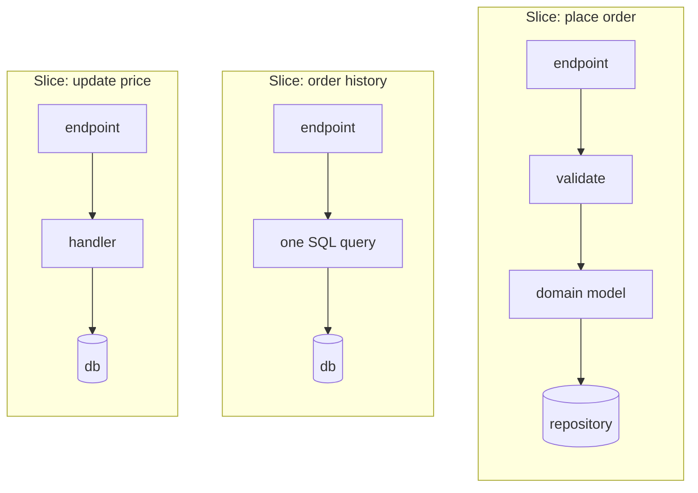
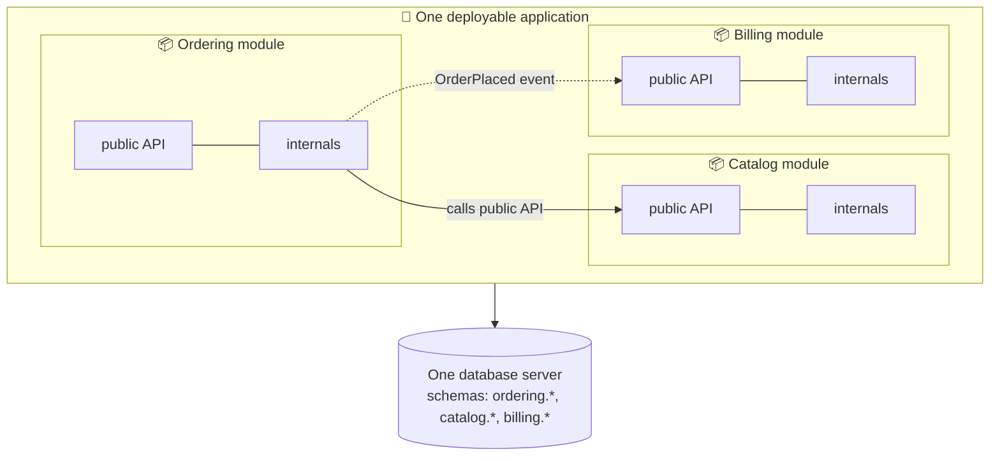

## Part 1: Vertical Slice Architecture

### The big idea

A supermarket can be organised by **type of container**: all cans in aisle 1, all bottles in aisle 2, all boxes in aisle 3. Or by **what you're shopping for**: breakfast aisle, baking aisle, pet aisle. When you want to make pancakes, the second layout is far easier.

**Layered architecture** organises code by technical role (controllers here, services there, repositories over there). **Vertical Slice Architecture** (popularised by Jimmy Bogard) organises code **by feature**: everything needed for "Place order" lives together.


### Layers vs slices

```text
❌ Organised by layer                     ✅ Organised by feature (slices)
src/                                     src/features/
├── controllers/                         ├── orders/
│   ├── OrderController.ts               │   ├── place-order/
│   └── ProductController.ts             │   │   ├── endpoint.ts
├── services/                            │   │   ├── handler.ts
│   ├── OrderService.ts                  │   │   ├── validation.ts
│   └── ProductService.ts                │   │   └── handler.test.ts
├── repositories/                        │   ├── cancel-order/
│   ├── OrderRepository.ts               │   └── get-order-history/
│   └── ProductRepository.ts             └── products/
└── dtos/ …                                  ├── search-products/
                                             └── update-price/
```

"Add a gift-message field to orders" now touches **one folder** instead of five.

### A slice = one request, top to bottom

Each slice handles **one use case** (a command or a query) from the endpoint all the way to the database, and chooses the **simplest implementation that fits that feature**.

```ts
// features/orders/get-order-history/handler.ts — a QUERY slice: simple, direct SQL
export async function getOrderHistory(db: Pool, customerId: string) {
  const { rows } = await db.query(
    `SELECT id, status, total_cents, created_at FROM orders
     WHERE customer_id = $1 ORDER BY created_at DESC LIMIT 50`,
    [customerId],
  );
  return rows;
}

// features/orders/place-order/handler.ts — a COMMAND slice: uses a rich domain model
export async function placeOrder(deps: { orders: OrderRepository; events: EventBus }, cmd: PlaceOrderCommand) {
  const order = Order.create(cmd.customerId, cmd.lines);   // business rules in the domain object
  await deps.orders.save(order);
  await deps.events.publish(order.pullEvents());
  return { orderId: order.id };
}
```



This fits naturally with **CQRS**: queries read directly, commands go through the domain.

### Rules of thumb

| Rule | Why |
| --- | --- |
| **Maximise coupling inside a slice, minimise it between slices** | A change stays in one place |
| **Slices don't call each other** | Share through the domain model, or events, instead |
| **Share deliberately** | Put truly common code (domain entities, auth, logging) in a `shared/` or `domain/` folder, only once it's needed in several slices |
| **Each slice picks its own complexity** | A simple read needn't pass through six layers |

### Trade-offs

✅ Features are easy to find, change and delete; there's less ceremony for simple use cases; parallel work causes fewer conflicts.
❌ Risk of duplicated logic between slices (refactor shared rules into the domain once they repeat); needs discipline so the domain model doesn't get skipped where it matters.

> 💡 Slices and Clean/Hexagonal aren't enemies. A popular combination: **vertical slices for the application layer** + a **shared domain model** in the centre + adapters at the edge.

---

## Part 2: The Modular Monolith

### The big idea

An **apartment building** is one structure with one foundation and one address, but inside it's divided into **separate apartments** with their own locked doors. Neighbours can't walk into each other's kitchens; they knock (a public interface).

A **modular monolith** is **one deployable application** divided into **strongly separated modules**, each owning its own code **and data**, talking only through explicit public interfaces.



### The rules that make it "modular"

1. **Modules follow business boundaries** (DDD bounded contexts), not technical layers.
2. **Each module has a public API** (a facade or interface); everything else is **internal**.
3. **No reaching into another module's tables.** Each module owns its schema.
4. **Modules communicate through public APIs or in-process events.**
5. **Enforce boundaries automatically**, or they will erode.

```text
src/modules/
├── ordering/
│   ├── index.ts          # ✅ public API: the only file others may import
│   ├── domain/ …         # 🔒 internal
│   ├── application/ …    # 🔒 internal
│   └── infrastructure/   # 🔒 internal (uses the "ordering" DB schema)
├── catalog/
│   └── index.ts          # export { getProductSnapshot } from "./application/…"
└── billing/
    └── index.ts
```

```ts
// modules/catalog/index.ts — the catalog's public API
export type ProductSnapshot = { id: string; name: string; priceCents: number };
export { getProductSnapshot } from "./application/getProductSnapshot";

// modules/ordering/application/placeOrder.ts
import { getProductSnapshot } from "@/modules/catalog";                     // ✅ public API
// import { ProductEntity } from "@/modules/catalog/infrastructure/orm";    // ❌ forbidden
```

### Enforcing boundaries

```js
// .dependency-cruiser.js — fail the build if a module imports another module's internals
module.exports = {
  forbidden: [
    {
      name: "no-reaching-into-other-modules",
      from: { path: "^src/modules/([^/]+)/" },
      to: { path: "^src/modules/([^/]+)/(?!index\\.ts$)", pathNot: "^src/modules/$1/" },
    },
  ],
};
```

Other options: `eslint-plugin-boundaries`, Nx module boundaries, separate packages in a monorepo, **ArchUnit** (Java) or **NetArchTest** (.NET).

### Why it's a great default

| | Traditional monolith | **Modular monolith** | Microservices |
| --- | --- | --- | --- |
| Deployables | 1 | 1 | Many |
| Internal boundaries | Weak, often a "big ball of mud" | ✅ Strong and enforced | ✅ Strong (the network) |
| Calls between parts | In-process | ✅ In-process (fast, reliable) | Network (slow, can fail) |
| Transactions | ✅ Easy | ✅ Easy within a module | ❌ Sagas |
| Operational complexity | ✅ Low | ✅ Low | ❌ High |
| Independent deploy and scale | ❌ | ❌ | ✅ |
| Path to microservices | Painful | ✅ Extract a module when needed | – |


Shopify, GitHub and Basecamp run very large systems as (modular) monoliths. Many teams that jumped straight to microservices have moved back. A modular monolith keeps the door open: when a module truly needs independent scaling or deployment, its boundary already exists, so extraction is mostly moving code and swapping an in-process call for a network call.

## Key takeaways

- **Vertical slices** organise code by feature: one folder per use case, top to bottom; each slice picks its own level of complexity.
- Slices pair well with CQRS and with a shared domain model in the centre.
- A **modular monolith** is one deployable with strict, business-aligned modules that own their code and data.
- Modules talk only through public APIs or events; enforce the boundaries with tooling.
- It's the recommended starting point for most systems, with an easy path to extracting services later.
