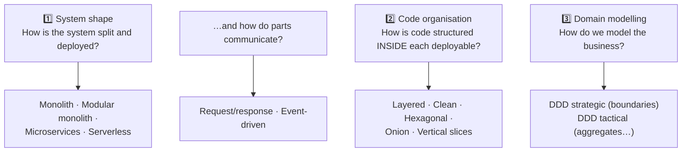
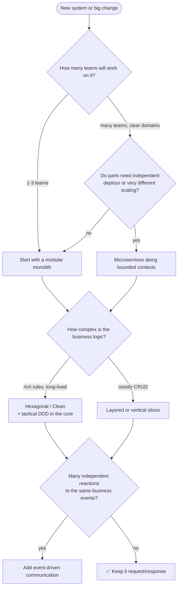
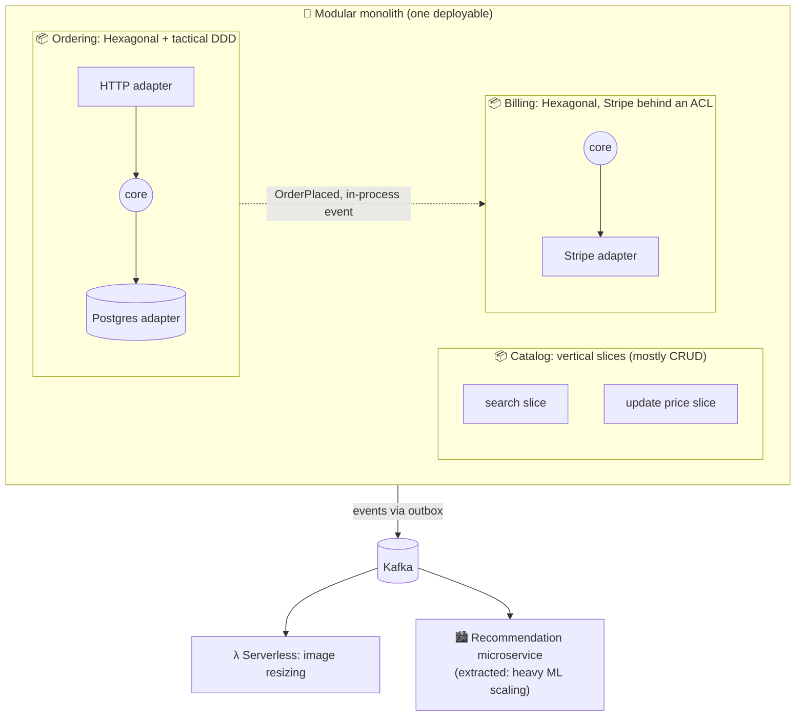
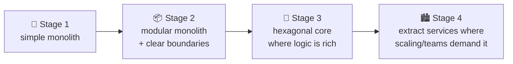
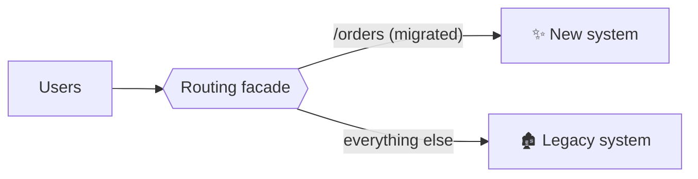

## The big idea

There's no "best vehicle". A bicycle, a van, a bus and a plane are each perfect for **some** journeys and silly for others. Choosing an architecture is the same: match the style to **the journey you're actually making**, meaning your domain, team, scale and stage.

## Two decisions, not one

Most confusion comes from mixing two separate questions:

You pick an answer to **each** question. For example: *a modular monolith (1), with Hexagonal modules (2), cut along DDD bounded contexts (3), talking via in-process events.*

## All the styles on one page

### Code organisation (inside one application)

| Style | Core idea | Best for | Watch out for |
| --- | --- | --- | --- |
| **Layered** | Presentation → business → data | Simple/CRUD apps, new teams | Business logic depends on the DB; changes cross all layers |
| **MVC / MVVM** | Separate view from model and logic | UI code (server pages, SPAs, mobile) | Only covers presentation |
| **Clean** | Circles; dependencies point inward; use cases | Rich business logic, long-lived apps | Ceremony for simple CRUD |
| **Hexagonal** | Core + ports; adapters on driving and driven sides | Many entry points, swappable integrations, testability | Ports for things that never change |
| **Onion** | Rings around the domain model | Domain-centric apps (.NET heritage) | Same as Clean |
| **Vertical slices** | Organise by feature, top to bottom | Feature-heavy apps, CQRS, fast iteration | Duplication without a shared domain |

### System shape

| Style | Core idea | Best for | Watch out for |
| --- | --- | --- | --- |
| **Monolith** | One deployable | Early products, small teams | Turning into a big ball of mud |
| **Modular monolith** | One deployable, strict modules | ✅ Most teams, most of the time | Needs boundary enforcement |
| **Microservices** | Independently deployable services | Many teams, very different scaling needs | Distributed-systems complexity |
| **Event-driven** | Components react to published facts | Many reactions to the same facts, integration, buffering | Eventual consistency, debugging |
| **Microkernel** | Small core + plug-ins | Extensible products, per-customer rules | Contract design and stability |
| **Serverless** | Functions triggered by events, managed services | Spiky workloads, event processing, zero-ops | Cold starts, limits, lock-in, cost at scale |

## A decision guide

### Quality attributes → styles that help

| If you most need… | Consider |
| --- | --- |
| **Speed of delivery now** | Monolith / modular monolith, layered or vertical slices, serverless for glue |
| **Testability of business rules** | Hexagonal / Clean / Onion |
| **Independent team autonomy** | Modular monolith → microservices |
| **Elastic scaling of hotspots** | Microservices or serverless for those parts |
| **Extensibility by others** | Microkernel / plug-ins |
| **Loose coupling between reactions** | Event-driven |
| **Low operating cost and complexity** | Modular monolith, serverless for spiky parts |

## They combine: a realistic example

Each part uses **the style that fits its needs**, and that's normal. Consistency *within* a module matters more than uniformity across the whole company.

## Evolutionary architecture

Architecture isn't decided once. Requirements, scale and teams change, so design for **change**:

| Practice | Why |
| --- | --- |
| **Delay irreversible decisions** until you have evidence (last responsible moment) | Avoid expensive guesses |
| **Keep boundaries clean** even inside a monolith | Future extraction becomes cheap |
| **Fitness functions**: automated checks for architecture rules (dependency rules, latency budgets) | Guard the architecture continuously in CI |
| **ADRs** for every significant decision | Future you understands the "why" |
| **Strangler fig** for big migrations: route traffic piece by piece to the new system | Replace legacy systems without a big-bang rewrite |

*The strangler fig pattern: new features and migrated routes go to the new system until the old one can be switched off.*

## Warning signs you picked the wrong style

| Symptom | Likely problem |
| --- | --- |
| Every small change needs 5 services deployed together | Distributed monolith; merge services or fix boundaries |
| Business rules scattered across controllers and SQL | Need a real domain core (Clean / Hexagonal) |
| Six layers of pass-through code for simple CRUD | Over-engineering; use slices or simple layers there |
| "Nobody knows what happens when an order is placed" | Event chains without visibility; add orchestration, tracing, an event catalog |
| Teams constantly blocked by each other in one codebase | Missing module boundaries or team alignment |

## Key takeaways

- Separate the questions: **system shape**, **code organisation**, **domain modelling**. Answer each.
- The safest default: a **modular monolith** along **DDD bounded contexts**, **Hexagonal/Clean** where logic is rich, simpler slices where it isn't.
- Add **events**, **microservices** or **serverless** for specific, proven needs.
- Mixing styles per module is normal; consistency inside a module matters most.
- Architecture evolves: keep boundaries clean, record decisions in ADRs, automate rules with fitness functions, migrate with the strangler fig.
