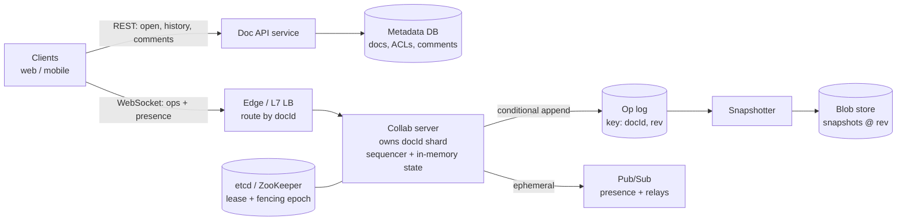

`Per-Doc Sequencer` · `OT / CRDT` · `Op Log + Snapshots` · `Ephemeral Presence`

## The problem

> Design a real-time collaborative document editor like Google Docs. Many users edit the same document at once and see each other's changes and cursors within ~100 ms. Edits must never be lost. Users can go offline, keep editing, and merge cleanly when they come back. Users can browse version history and restore old versions.

**L6 expectation:** lead the scoping, pick a concurrency model and defend it, find the hot spots (hot documents, sequencer failover, long offline merges) without being prompted, and talk about operating the system, not just the boxes.


## 1. Requirements

**Functional**

1. Create, open and edit rich-text documents.
2. Concurrent edits from N users converge to the same state.
3. Live cursors, selections and presence ("Alice is viewing").
4. Offline editing with a merge on reconnect.
5. Version history and restore.
6. Comments and permissions (owner, editor, commenter, viewer).

**Non-functional**

| Property | Target |
| --- | --- |
| Edit propagation latency | p99 < 200 ms in-region |
| Durability | An acked edit is never lost (RPO = 0) |
| Convergence | Every replica ends up with an identical document |
| Availability | 99.99% for editing |
| Hot doc | 100 concurrent editors + 10k viewers |

**Out of scope (say it out loud):** spreadsheet and slide engines, full-text search, rendering and layout.

## 2. Back-of-the-envelope

```text
DAU                          : 50M
Peak concurrent docs open    : 5M
Peak active typists          : 3M
Ops/sec per typist (batched) : ~2    (client batches keystrokes every 50–100 ms)
Peak write ops/sec           : ~6M ops/s
Avg op size (with metadata)  : ~150 B  -> ~900 MB/s ingest
Raw op log per day           : ~25–40 TB/day before compaction
Snapshot size (avg doc)      : ~50 KB; 5B docs -> ~250 TB of snapshots
Cursor/presence messages     : ~10x op volume, but EPHEMERAL (never stored)
```

**Takeaway:** total traffic is high, but it is spread across millions of small, independent documents, so it shards cleanly by `docId`. The hard parts are **ordering inside one document** and **hot documents**, not raw throughput.

## 3. The core decision: OT vs CRDT

| | OT (Operational Transformation) | CRDT (Yjs / Automerge / Fugue) |
| --- | --- | --- |
| Needs a central order? | Yes, a per-doc sequencer | No, merges commutatively |
| Metadata overhead | Small (ops carry a position) | Larger (unique ID per character, tombstones) |
| Offline / P2P | Weak, long rebase chains | Strong, merge at any time |
| Rich text and intent | Mature (Google Docs) | Good now (Peritext, Yjs) |
| Server complexity | Transform logic on the server | Server can be a relay plus persistence |

**Recommendation:** a **server-sequenced model with a single writer per document**, using **CRDT merge semantics** for the document data.

- The sequencer gives a **total order**, a monotonic `rev`, a simple durable log and cheap version history.
- CRDT semantics make **offline merge** and reconnect trivial (no N×M transform chains), and replicas converge even when messages are reordered.
- The cost is metadata growth, handled by **periodic compaction** that garbage-collects tombstones in snapshots.

> If the interviewer pushes for "online-only, minimal storage", **pure OT with a central server** (the Jupiter model) is also valid. State the trade-off and move on.

## 4. High-level architecture



## 5. API and protocol

```http
GET  /docs/{docId}                 -> { snapshot, snapshotRev, opsSince[], acl }
GET  /docs/{docId}/history?before= -> [ { rev, author, ts, summary } ]
POST /docs/{docId}/restore         -> { rev }
WS   /docs/{docId}/stream
```

```jsonc
// client -> server
{ "type": "op", "clientId": "c42", "clientSeq": 118, "baseRev": 9031,
  "ops": [ /* CRDT update or OT ops */ ] }
{ "type": "presence", "cursor": { "anchor": "id:c7#55", "head": "id:c7#60" } }

// server -> client
{ "type": "ack", "clientSeq": 118, "rev": 9034 }
{ "type": "remote_op", "rev": 9035, "author": "c19", "ops": [ ... ] }
{ "type": "presence", "user": "u19", "cursor": { ... } }   // throttled to 50 ms
```

`(clientId, clientSeq)` makes every op **idempotent**, so resending after a reconnect is always safe.

## 6. Data model

```sql
-- Metadata DB
docs(doc_id PK, owner_id, title, created_at, latest_rev, latest_snapshot_rev, epoch)
acl(doc_id, principal_id, role)            PRIMARY KEY (doc_id, principal_id)
comments(doc_id, comment_id, anchor_id, body, author, resolved)

-- Op log (wide-column: partition = doc_id, clustering = rev)
ops(doc_id, rev, client_id, client_seq, author, ts, payload BLOB)
     PRIMARY KEY ((doc_id), rev)

-- Blob store
snapshots/{doc_id}/{rev}.bin   -- compacted CRDT state, tombstones GC'd
```

Comment anchors use **CRDT element IDs**, not character offsets, so they survive concurrent edits.

## 7. Write path

1. The client applies the edit **optimistically** to local state, so typing has zero latency.
2. It sends `{clientId, clientSeq, baseRev, ops}` over the WebSocket.
3. The edge routes by `docId` to the **owning collab server** (consistent hashing plus a lease registry).
4. The sequencer de-duplicates on `(clientId, clientSeq)` and integrates the op into in-memory state.
5. It assigns `rev = lastRev + 1` and does a **conditional append**:
   ```sql
   INSERT INTO ops (doc_id, rev, ...) VALUES (...) IF NOT EXISTS
   ```
6. **Only after the durable write** does it send `ack{rev}` to the author and broadcast `remote_op` to other subscribers.
7. Every N ops (for example 1,000) or T minutes, the snapshotter writes a compacted snapshot; old log segments tier to cold storage.

**Open path:** load the latest snapshot, replay `ops WHERE rev > snapshotRev`, then subscribe to the stream.

## 8. Deep dives (where L6 is won)

### A. Sequencer failover without split-brain

- Each collab server holds a **lease** per doc shard in etcd and gets a **fencing epoch**.
- A server paused by GC or cut off by a partition can wake up and keep writing after a new owner has taken over.
- **Defence 1:** the conditional append on `(docId, rev)` means two writers can never both commit the same `rev`.
- **Defence 2:** the log rejects writes whose `epoch` is lower than the doc's current epoch.
- **Recovery:** the new owner loads snapshot + log tail; clients reconnect with `lastAckedRev` and resend unacked ops, and idempotency drops duplicates.
- Failover time ≈ lease TTL (5–10 s). Clients keep typing locally the whole time, so users barely notice.

### B. Hot documents (100 editors + 10k viewers)

- **Editors** stay on the single sequencer: 100 writers × 2 ops/s = 200 ops/s, easy for one process.
- **Viewers** never touch the sequencer. Use **tiered fan-out**: the sequencer publishes to a few **relay nodes**, and each relay serves thousands of read-only sockets.
- **Presence:** throttle to 50 ms, coalesce per user, and for large audiences show "+9,800 viewers" instead of streaming every cursor (**lazy presence**).

### C. Offline editing and long divergence

- The client keeps local CRDT state plus a queue of unacked updates in IndexedDB.
- On reconnect it sends a **state vector** ("I have seen up to X from each client"). The server returns only the missing updates and the client pushes its own. CRDT merge is commutative, so there is no transform explosion.
- **Guardrails:** if the doc was compacted past the client's base, do a full-state merge. If access was revoked while offline, **reject the ops and keep a local copy** the user can export.

### D. Storage growth and compaction

- Tombstones (deleted characters) grow forever in a naive CRDT.
- Snapshots **GC tombstones that every live client has already seen** (the minimum state vector). Clients older than that resync fully.
- History: keep the fine-grained op log for 30 days, then **thin to hourly checkpoints** in cold storage.

### E. Security and permissions

- Check the ACL on WebSocket connect **and** cache it on the collab server with a short TTL.
- On revoke, the metadata service publishes an event and the collab server **closes the socket immediately**.
- Validate every op server-side (a viewer sending ops is rejected) and apply a per-user rate limit.

### F. Undo

Undo is **per user**, not global. Ctrl-Z reverts *my* last change by generating an inverse op against the current state. It never rolls the whole document back to an earlier `rev`.

## 9. Failure modes

| Failure | Impact | Mitigation |
| --- | --- | --- |
| Collab server crash | Edits pause ~5–10 s | Lease expiry → new owner, client resend |
| Zombie old owner | Duplicate or forked revs | Fencing epoch + conditional append |
| Op log region outage | No acks | Multi-region replicated log; clients buffer locally |
| Network flap | Duplicate ops | `(clientId, clientSeq)` idempotency |
| Malformed or malicious op | Corrupt document | Server-side validation and schema checks |
| Divergence bug | Users see different text | Periodic **state checksum** in acks; auto-resync on mismatch |

## 10. Interviewer follow-ups

1. **Why not let every server accept writes for a doc?** Multi-writer per document needs consensus per keystroke, which adds latency and complexity. A single writer with fast, fenced failover is simpler and meets the SLO.
2. **How do you go multi-region?** Home each document in one region near most of its editors. Remote users pay cross-region RTT on acks but still type locally. Migrate a doc's home if its editor population shifts.
3. **How do you detect divergence in production?** The server sends a rolling hash of document state every K revs; the client compares, reports telemetry and resyncs on mismatch.
4. **What changes for a 1 GB document?** Split it into **sections/blocks**, each with its own CRDT and lazy loading, so the sequencer only holds the active blocks in memory.

## Summary

**Shard by `docId` with a single fenced writer per document, give each document a durable totally-ordered op log with snapshots, use CRDT merge for offline, and keep presence ephemeral with tiered fan-out for hot documents.**

**Watch:** ack p99, failover duration, divergence-checksum mismatches, op-log write latency, snapshot lag, and tombstone ratio per document.
